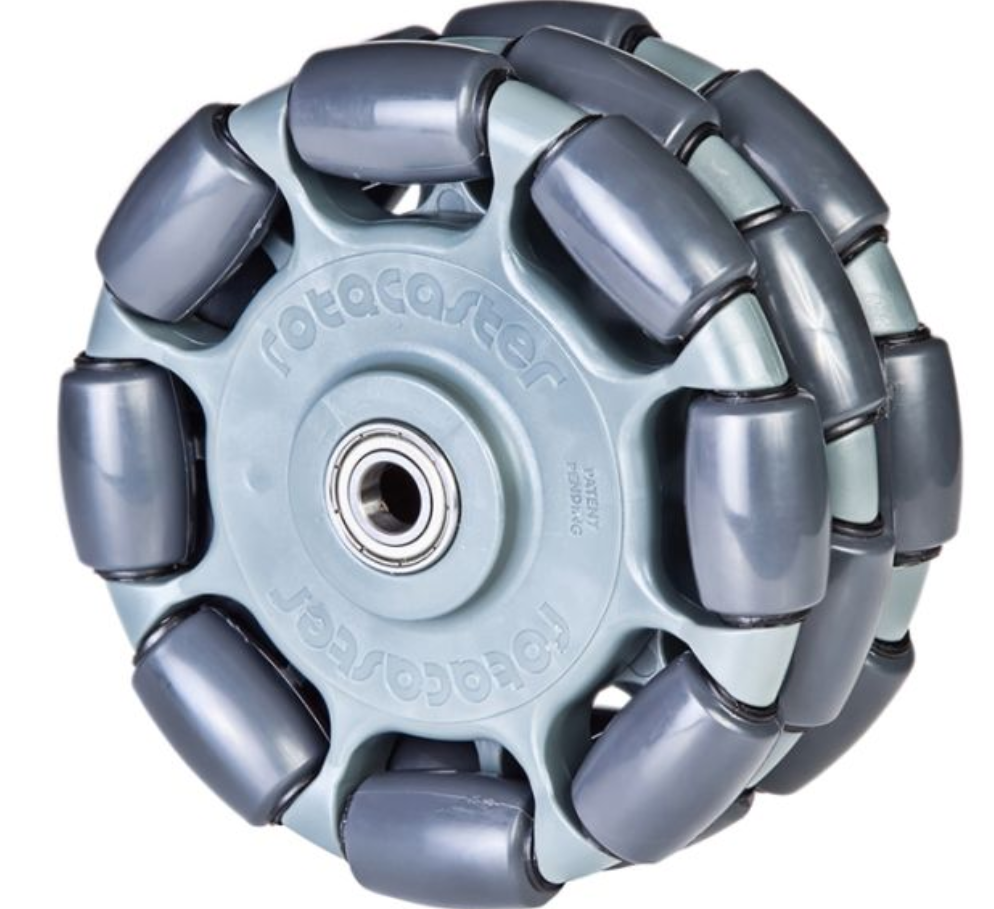
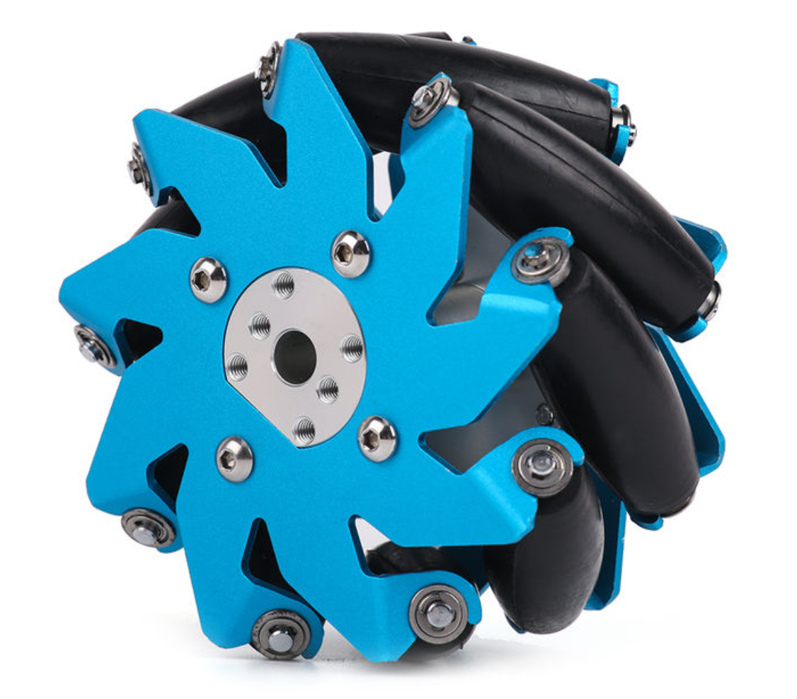
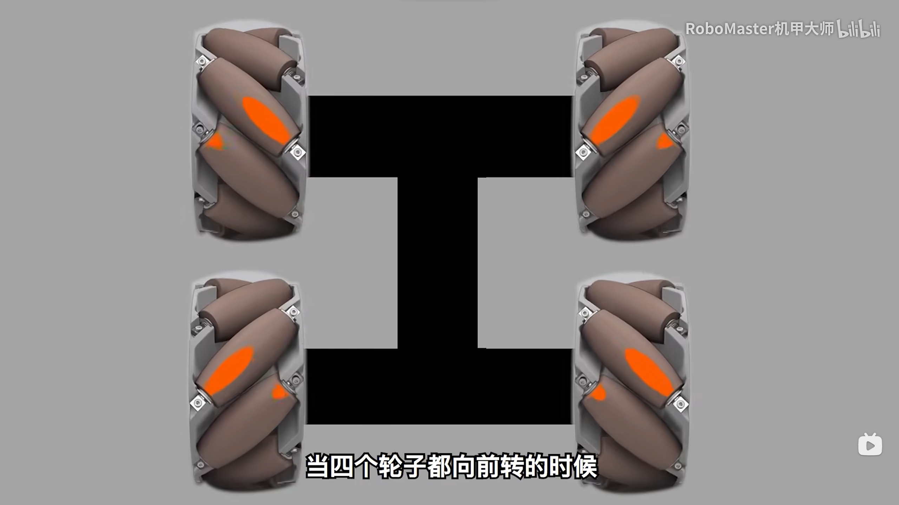
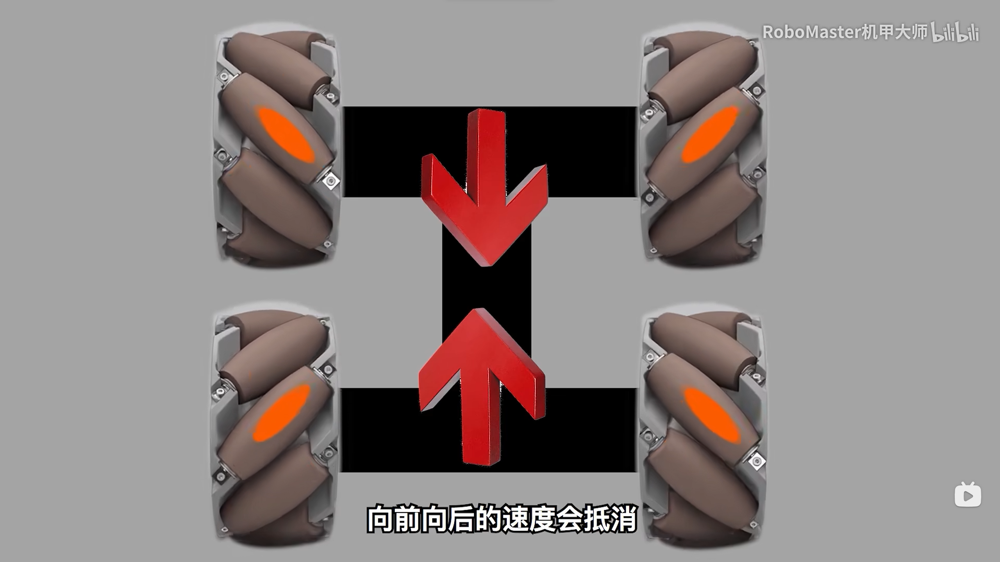
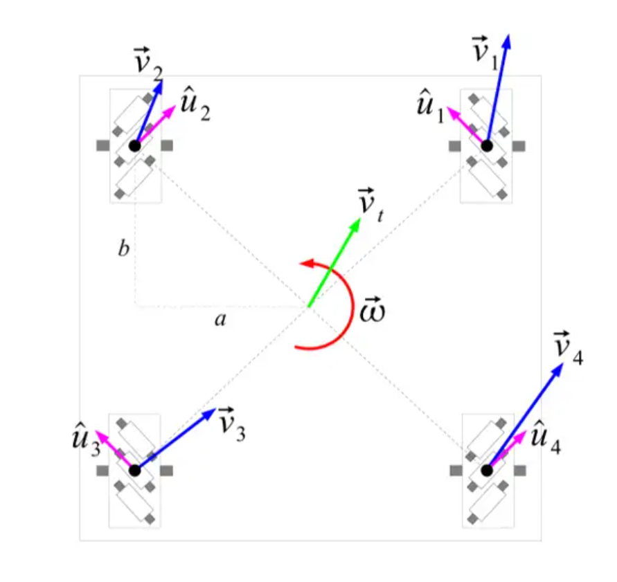

# 
Birdiebot Note
# 
木鸢机甲培训笔记
## 
Chapter01 通识课培训
This file sync GitHub:
https://github.com/HsxMark/TrashCanCodes.git
#### 零、预备队要求
要求1：按时完成各组培训负责人安排的任务，重点**学习报告**！
要求2：互帮互助，团结友爱，融入实验室氛围
要求3：参与过实验室内项目（装配、焊接、辅助调试）
要求4：完成各个组的入队指标。
#### 一、机器人通识

由电子计算机控制，代替人工工作的自动机械

机器人技术方向
(1)结构:机器人上的传动部分就是机械需要做的事情。
机械结构设计与装配、零件材料选择与制造、结构合理性分析……
(2)嵌入式:机器人上电机驱动、功率限制、电路部分
内嵌电路板与传感器、线路布置、人机交互、电机控制……
(3)算法:让机器人从智能人工变成人工智能。
AI识别、环境交互、全局感知、路径规划……

机器人发展
（1）重复劳动取代
（2）危险作业----------->机器人迅速发展------->科技水平提高、需求骤增
（3）教育

#### 二、实验室准则
1.拿电池的时候注意，**寿命高的是上场电池**，正式比赛用。平时用寿命较低的测试电池。
注意：其余兵种不要拿空中专用电池
2.电源分正负极，请不要反接任何电源接口
通常我们使用的接插件为XT30\XT60系列，本身具有防呆设计
>但是防呆不防傻，总有人大力出奇迹,拔插接口请三思

当发现端口很松的时候：糊胶、开十字、换端子、换线
3.如果在实验室或者地库发现野生电机电调，请**不要直接**装车,请先把它们给硬件组电控组的同学测试一下。确保电机电调是好的再装车
4.非硬件组同学，在不确定哪根线是哪根线的情况下，一定**不要自己插拔线**！！！
哪怕只是一根线不确定，也要叫硬件来操作
只要是和短路相关的问题，都第一时间下电，然后叫硬件上班
车辆冒烟或者有味道，立刻下电，闻到碳板的味道叫硬件来维修，如果没有那也要叫硬件来修
5.工具使用
使用完焊台、风枪后必须关闭设备；镊子、水口钳一类工具，使用完后放回原位，不要随手乱放

#### 三、全向轮与麦克纳姆轮
>孩子们，这个轮子好玩

全向轮和麦克纳姆轮（以下简称麦轮）在竞赛机器人和特殊工种机器人都是重要的全向移动工具,每个轮子独立控制并产生不同方向的力，结合多个轮子的作用力可以实现各种复杂的运动。他们都是由两大部分组成：**轮毂和辊子**
轮毂：主体支架
辊子：安装在轮毂上的鼓状物

图1全向轮

图2麦克纳姆轮

二者的主要区别是轮毂轴与辊子转轴的角度不同,全向轮是垂直安装，麦轮是45°安装。这里主要整理麦轮
##### 麦轮
>以下内容整理自知乎和BlilBili

麦轮是机甲大师中最常见的轮子，其稳定性和灵活性广受各大高校战队欢迎
麦轮和普通轮子一样，可以正常向前行驶，但是给予一个纵向的扰动，麦轮就会因为辊子的存在而开始纵向移动，非常神奇。

麦轮分为AB轮，对轮子进行速度分解，可以分为轴向向左（右）和垂直向前（后）的速度分量，AB轮为径向速度关系。因此，安排好轮子的安装方式能确保小车的运动轨迹。

我们仅挑一个案例分析麦轮的安装方法以及实现转向的原理，并且会附上图片解释

如图所示，这是一个ABAB形式的车轮，从左到右，从上到下依次为BABA在此情况下，如果进行前进操作，上方两个麦轮的轴方向向内，下方的轴方向向外，这样，我们可以在车前进的过程中保持直行，不会发生偏移。

如图所示，当A正B反转动的时候，向前和向后的速度抵消，车辆会向左移动。向右转同理。

计算方法是这样

图中a,b为长度
$$
\begin{align*}
v_x &= v_{tx} + \omega b, \\
v_y &= v_{ty} - \omega a
\end{align*}
$$
根据旋底盘运动状态来表示每个轮子的转速：
$$
\begin{align*}
v_{w1} &= v_{ty} - v_{tx} + \omega (a + b), \\
v_{w2} &= v_{ty} + v_{tx} - \omega (a + b), \\
v_{w3} &= v_{ty} - v_{tx} - \omega (a + b), \\
v_{w4} &= v_{ty} + v_{tx} + \omega (a + b)
\end{align*}
$$
~~好吧，其实我也看不懂这个计算~~
同时我注意到，这种方法会导致车辆和地面摩擦力增大，导致车辆行驶速度较慢。
#### 四、感想
虽然本次培训由于课程冲突没有到现场，但是我仍旧努力学习知识，提升自己的能力，认真完成要求
祝愿培训顺利！

王俊桦  

HsxMark  
2024/09/27  

